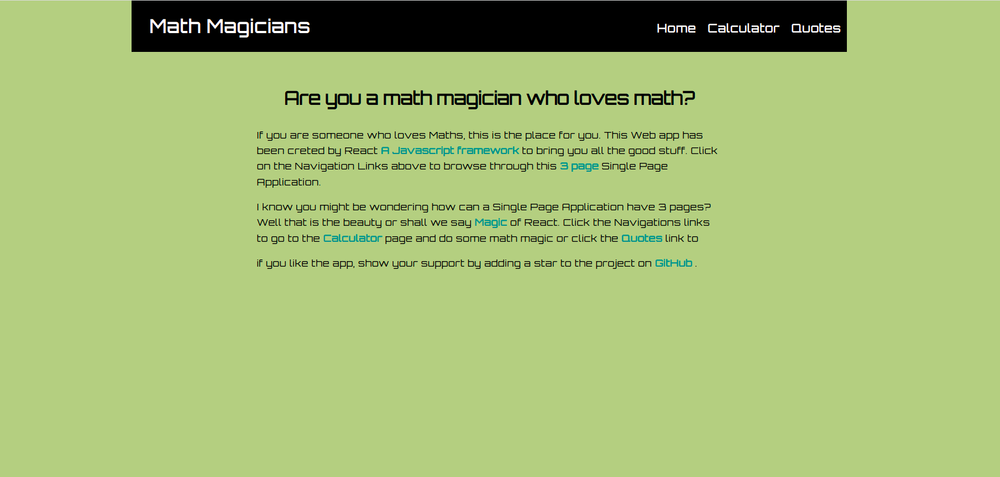
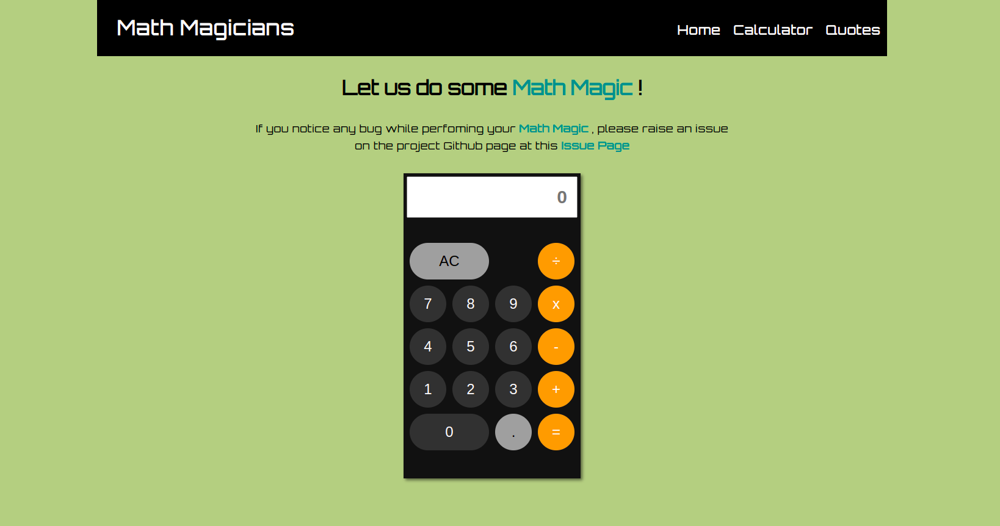

## Preview

Homepage

Calculator

<h1 align="center"> Math Magicians </h1>

> Dive into the world of a math magician where you can make calculations while getting a peak inside the brilliant minds of the greatest mathematicians.

## Built With

- **REACT** **Javascript** **CSS** 

## DEMO

- **Netlify Live Link** [Netlify](https://espada-math-magician.netlify.app/)
  
- **Heruku Live Link** [Heroku](https://espada-math-magician.herokuapp.com/)
  
## Video Description

- 

## Getting Started

To get a local copy up and running follow these setup steps below.

### Setup

- Simply fork this project
- run `npm i `to install all dependencies
- run `npm run build` to bundle the project with webpack, and
- run `npm start` to launch the application
- Open [http://localhost:3000](http://localhost:3000) to view it in your browser.

## Authors

👤 **Authors**

- GitHub: [Ben Kiarie](https://github.com/Benmuiruri)
- Twitter: [Optimize](https://twitter.com/_optimize)
- LinkedIn: [Ben Kiarie](https://www.linkedin.com/in/benjamin-kiarie-180b66149/)

## 🤝 Contributing

Contributions, issues, and feature requests are welcome!

Feel free to check the [issues page](https://github.com/Benmuiruri/math-magician/issues).

## Show your support

Give a ⭐️ if you like this project!

## Acknowledgments

Huge thanks to everyone who helped us in any capacity to complete this project

## 📝 License

This project is [MIT](https://opensource.org/licenses/MIT) licensed.

